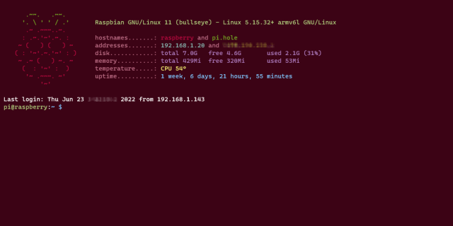

# Raspberry Pi

## 10-motd-berry, 10-motd-telly
Scripts to generate a dynamic "message of the day" for the Raspberry Pi.



## Install

```
sudo cp 10-motd-berry /etc/update-motd.d/
```

```
sudo rm /etc/motd
sudo rm /etc/update-motd.d/10-uname
```